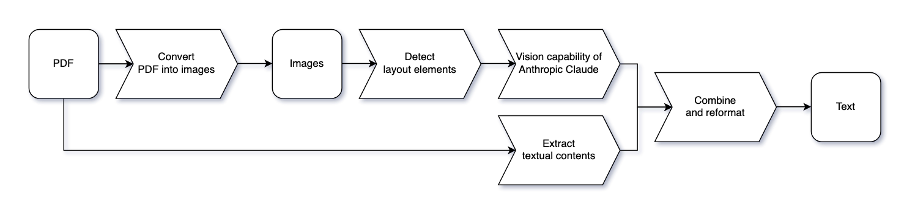
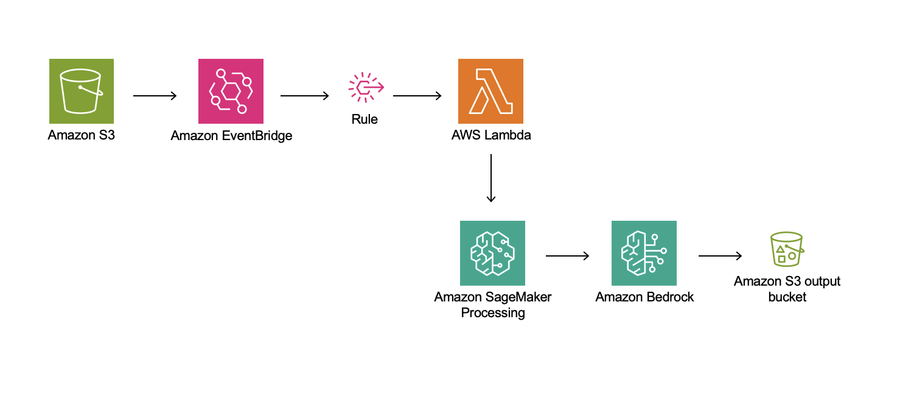

# Unlock the Power of Chinese OCR with Amazon Bedrock and the Anthropic Claude Model

Introduction

To address the unique challenges of Chinese OCR and enable the seamless ingestion of diverse document types into a Retrieval-Augmented Generation (RAG)-ready knowledge base, this solution leverages the advanced capabilities of the Anthropic Claude model, made available through Amazon Bedrock. By integrating the Anthropic Claude model's state-of-the-art vision and language understanding abilities, we can create a comprehensive document processing pipeline that accurately detects layout elements, recognizes Chinese characters, and extracts structured content from complex documents.

Solution Overview

The proposed solution consists of the following key components:

- PDF conversion – We use pdfplumber to convert the input PDF documents into high-resolution images, optimizing the input for the Anthropic Claude model’s vision capabilities
- Text extraction with layout awareness – We use pdfplumber to extract the textual content from the original PDF document, enabling cross-validation of the OCR results
- Content integration – We combine the extracted text, table cell content, and image descriptions, preserving the original order and structure of the document
- Output generation – Lastly, we generate the final output as a structured text file, which can then be chunked into smaller segments to serve as input for a RAG solution

The following diagram shows the workflow of the proposed solution.

_Figure 1: The diagram illustrates the step-by-step process of the proposed solution, starting from the input PDF document and culminating in the final text output._

The solution architecture uses a combination of AWS services, including:

- Amazon Bedrock – We integrate the Anthropic Claude model through Amazon Bedrock to enable the advanced vision and language understanding capabilities required for Chinese OCR
- Amazon SageMaker – We use SageMaker Processing jobs to batch process the PDF pages, improving the overall efficiency and scalability of the solution
- Amazon Simple Storage Service – Amazon S3 provides storage for the input PDF documents and the processed output
- AWS Lambda – Lambda runs code in response to triggers, allowing for serverless processing and integration between other AWS services
- Amazon EventBridge – EventBridge invokes the document processing workflow and coordinates the execution of the different steps

The following diagram depicts the solution architecture using various AWS services.

_Figure 2: This architecture demonstrates a serverless, event-driven approach to data processing that combines storage, event management, serverless computing, machine learning, and AI services to create a scalable and efficient data processing workflow._

Conclusion

This solution demonstrates a serverless, event-driven approach to data processing that combines storage, event management, serverless computing, machine learning (ML), and AI services to create a scalable and efficient data processing workflow.
